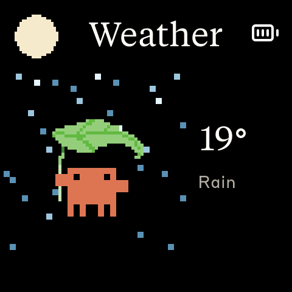

# Clawdmeter


A small ESP32 dashboard I made for my desk to keep an eye on Claude Code usage.

It runs on a [Waveshare ESP32-S3-Touch-AMOLED-2.16](https://www.waveshare.com/esp32-s3-touch-amoled-2.16.htm?&aff_id=149786) as well as a few other alternative boards and pairs over Bluetooth, the splash screen plays pixel-art Clawd animations that get
busier when your usage rate climbs. The two side buttons send Space and
Shift+Tab over BLE HID for Claude Code's voice mode and mode-toggle shortcuts.


## Screens

The device boots into the splash. Tap the screen anywhere to switch to the Usage view; tap again to flip back to the splash.

|                          Splash                           |                         Usage                          |
| :-------------------------------------------------------: | :----------------------------------------------------: |
|  |  |
|               Splash; touch-toggle anytime                | Session and weekly utilization                         |

While the splash is up, the middle (PWR) button cycles animations. **Hold the power button for 3 seconds, then release, to put the device into pairing mode** — this clears the saved Bluetooth bond and re-advertises. The firmware also auto-rotates animations every 20 s within the current usage-rate group, so a long stretch on the splash isn't just one Clawd on loop.

On a board with an IMU — the AMOLED-2.16 today — a quarter turn shows a third and fourth screen, and turning back restores the one you were on. Both stay dark until the daemon is told to fetch them; see [Turn the device](#turn-the-device).

|                          Weather                           |                         Stocks                          |
| :--------------------------------------------------------: | :-----------------------------------------------------: |
|  |  |
|              Conditions, and the moon's phase              |          Your own tickers, and a coin           |

The moon appears only while it is actually above the horizon, which is not the same thing as night. Quotes are red for up, the Taiwan convention and the opposite of the American one, and the coin keeps turning after the bell.

## What this fork adds

Everything above is [HermannBjorgvin/Clawdmeter](https://github.com/HermannBjorgvin/Clawdmeter), which this fork tracks. Three things sit on top of it. All are optional, and the two that need setup are off until you turn them on.

### Turn the device


On a board with an IMU — the AMOLED-2.16 today — a quarter turn swaps what the screen shows, and turning back restores what you were looking at:

|          Upright | A quarter turn one way             | A quarter turn the other                |
| ---------------: | :--------------------------------- | :-------------------------------------- |
| Usage, as before | **Weather**, and the moon's phase  | **Your own stock quotes**, and a coin    |

The board does no networking of its own. The daemon fetches both and sends them in the same BLE write as the usage numbers, so there is no API key on the device, no Wi-Fi password in its flash, and no second radio competing with BLE HID for the 2.4 GHz band.

Weather comes from [Open-Meteo](https://open-meteo.com) — no account, no key — at most once every ten minutes. The moon icon appears only while the moon is actually above the horizon, which is not the same thing as night. Clear, cloudy and rain each put a creature beside the temperature; the other six conditions keep the plain centred layout rather than borrow an animal that means a different sky, because the one thing this screen is for is saying what it is actually like outside. Quotes come from the Taiwan exchange's own endpoint and are labelled *at last close* outside 09:00–13:30 on weekdays, because for most of any day the number is not live and an unlabelled price is a quiet lie.

Both are off until you set them. Copy [`daemon/config.example`](daemon/config.example) to your config file — it documents each key where you edit it. Your tickers stay in that file on your own machine: the device displays them, and nothing uploads them anywhere.

### Draw your own animations

The splash plays Anthropic's official Clawd art. It will also play whatever you draw, and the editor for that is in this repo — one self-contained HTML file, no build step and no server.

**→ [Clawdmeter animation editor](https://tb1982.github.io/Clawdmeter/tools/anim_editor.html)**

It opens in Español, English, 日本語, 繁體中文 or 简体中文 — whichever your browser asks for, with a picker at the top to change it. That list is the editor's own: the device's screens are English.

It carries what the firmware cares about rather than what a general pixel editor offers: the grid sizes the pipeline accepts, the palette cap enforced, per-frame hold times, onion skin, playback at the real holds, and both device previews on black — because a colour that looks fine on white can vanish on the panel, and a shape that reads at 24 px per cell can turn to mush at 4. Every animation in the catalogue is embedded as a loadable sample, so an existing one can be opened and altered rather than rebuilt from an empty grid.

A frame fragment copied there goes onto the system clipboard as plain text, so it can be pasted into another frame, another document, or another program entirely. The format is written down in [`docs/animation-contract.md`](docs/animation-contract.md) for anyone who wants to read or write it.

See [`tools/README.md`](tools/README.md) for the whole pipeline: drawing, importing hand-drawn frames from images, previewing without hardware, and taking an animation back off the board as a GIF.

### Send them somewhere else

Upstream's `tools/` has no editor and no JSON format, so a fork of it cannot play any hand-drawn animation — not one of these, not one of its own. `tools/export_upstream.js` closes that: it rewrites an animation into upstream's own struct and emits a header they can compile without changing a line of their code.

```bash
node tools/export_upstream.js --name "rainy days" --out nova_anims.h
```

Nothing is resampled and nothing is silently dropped — see [`tools/README.md`](tools/README.md) § 2f for what it refuses and why refusing is the point.

## Hardware

Boards supported out of the box:

- [Waveshare ESP32-S3-Touch-AMOLED-2.16](https://www.waveshare.com/esp32-s3-touch-amoled-2.16.htm?&aff_id=149786)
- [Waveshare ESP32-C6-Touch-AMOLED-2.16](https://www.waveshare.com/esp32-c6-touch-amoled-2.16.htm?&aff_id=149786)
- [Waveshare ESP32-S3-Touch-AMOLED-1.8](https://www.waveshare.com/esp32-s3-touch-amoled-1.8.htm?&aff_id=149786)
- [Waveshare ESP32-C6-Touch-AMOLED-1.8](https://www.waveshare.com/esp32-c6-touch-amoled-1.8.htm?&aff_id=149786)
- [Waveshare ESP32-S3-Touch-AMOLED-2.06](https://www.waveshare.com/esp32-s3-touch-amoled-2.06.htm?&aff_id=149786)
- [Waveshare ESP32-S3-Touch-LCD-1.54](https://www.waveshare.com/esp32-s3-lcd-1.54.htm?sku=33869&aff_id=149786)

> Please check if a pull request exists for your alternative hardware port before opening a new one, providing QA feedback and testing on the same hardware is more valuable than duplicate pull requests.

**Porting to another board:** the firmware is a thin HAL with per-board folders under `firmware/src/boards/`. Drop in a new folder and a new PlatformIO env — `main.cpp`, `ui.cpp`, and `splash.cpp` never need to change. See [`docs/porting/adding-a-board.md`](docs/porting/adding-a-board.md) for the walk-through and [`docs/porting/hal-contract.md`](docs/porting/hal-contract.md) for the interfaces a port must implement.

## Prerequisites

- Linux (tested on Ubuntu), macOS, or Windows 10/11
- [PlatformIO CLI](https://docs.platformio.org/en/latest/core/installation/index.html)
- Linux: `curl`, `bluetoothctl`, `busctl` (BlueZ Bluetooth stack)
- macOS: `python3` (the installer sets up a venv with `bleak` and `httpx`)
- Windows: `python3` 3.11+ (the installer sets up a venv with `bleak`, `httpx`, and `pystray`)
- Claude Code with an active subscription

## macOS installation

The macOS host pieces — Python daemon, LaunchAgent, and flash helper — were ported by [Chris Davidson (@lorddavidson)](https://github.com/lorddavidson). Thanks Chris!

### Flash the firmware

```bash
./flash-mac.sh waveshare_amoled_216                       # auto-detects /dev/cu.usbmodem*
./flash-mac.sh waveshare_amoled_18  /dev/cu.usbmodem1101  # or pass an explicit USB serial port
```

The board env name is required. Run `./flash-mac.sh` with no args to see the available envs (scraped from `firmware/platformio.ini`).

### Pair the device

After flashing, open **System Settings → Bluetooth** and click _Connect_ next to "Clawdmeter". The daemon only ever connects to the peripheral this Mac is paired/connected to — it never scans for a nearby device — so once it's connected here the daemon picks it up on its next poll (~60 s).

### Install the daemon

The daemon reads your Claude OAuth token from the macOS Keychain (service `Claude Code-credentials`), polls usage every 60 s, and pushes it to the display over BLE.

```bash
./install-mac.sh
```

The installer creates a Python venv in `daemon/.venv/`, installs `bleak` and `httpx`, renders a LaunchAgent into `~/Library/LaunchAgents/com.user.claude-usage-daemon.plist`, and loads it. The first run is launched interactively so macOS prompts for Bluetooth permission.

Useful commands:

```bash
launchctl list | grep claude-usage                                          # check it's running
tail -F ~/Library/Logs/claude-usage-daemon.out.log                          # live logs
launchctl unload ~/Library/LaunchAgents/com.user.claude-usage-daemon.plist  # stop
launchctl load -w ~/Library/LaunchAgents/com.user.claude-usage-daemon.plist # start
```

## Linux installation

### Flash the firmware

```bash
./flash.sh waveshare_amoled_216                  # defaults to /dev/ttyACM0
./flash.sh waveshare_amoled_18  /dev/ttyACM1     # or pass an explicit USB serial port
```

The board env name is required. Run `./flash.sh` with no args to see the available envs (scraped from `firmware/platformio.ini`).

### Pair the device

After flashing, the device advertises as "Clawdmeter". Pair it once:

```bash
# Scan for the device
bluetoothctl scan le

# When "Clawdmeter" appears, pair and trust it
bluetoothctl pair F4:12:FA:C0:8F:E5    # use your device's MAC
bluetoothctl trust F4:12:FA:C0:8F:E5
```

To re-pair later, hold the power button for 3 seconds then release — the device clears its saved bond and re-advertises.

### Install the daemon

The daemon polls your Claude usage every 60 seconds and sends it to the display over BLE.

```bash
./install.sh
systemctl --user start claude-usage-daemon
```

Check status: `systemctl --user status claude-usage-daemon`

View logs: `journalctl --user -u claude-usage-daemon -f`

## Windows installation

Runs natively on Windows — no WSL required. A system-tray app polls your usage and pushes it over BLE, and starts automatically at login.

### Prerequisites

- **Native Windows** (not WSL).
- **Python 3.11+** from [python.org](https://www.python.org/downloads/) — check _"Add python.exe to PATH"_ during install.
- **Claude Code** installed, with `claude login` completed. The token is read from `%USERPROFILE%\.claude\.credentials.json` (falling back to `%LOCALAPPDATA%\Claude\` then `%APPDATA%\Claude\`).
- The repo on a **native Windows path** (e.g. `%USERPROFILE%\Clawdmeter`), **not** a `\\wsl$` share — the installer refuses a WSL path.

### Flash the firmware

```powershell
pio run -d firmware -e waveshare_amoled_216 -t upload --upload-port COM5   # use your device's COM port
```

Run `pio run -d firmware` with no env to see the available board envs.

### Pair the device

The device is a bonded BLE HID keyboard, so pair it once: **Settings → Bluetooth & devices → Add device → Bluetooth**, then select "Clawdmeter". Pairing is **required** — it enables the physical buttons and keeps a persistent connection (the device keeps showing your last-synced usage even after the daemon quits). To undo, use **Remove device** (this disables the buttons).

### Install the daemon (recommended)

From the repo root in PowerShell:

```powershell
powershell -ExecutionPolicy Bypass -File install-windows.ps1
```

This creates a venv, installs `bleak`/`httpx`/`pystray`/`Pillow` from the in-repo requirements (no internet downloads), registers a per-user login-autostart entry (`HKCU\…\Run`, no admin needed), and launches the tray app headlessly (no console window).

### Run manually instead (optional)

```powershell
python -m venv .venv
.venv\Scripts\Activate.ps1        # if blocked: Set-ExecutionPolicy -Scope CurrentUser RemoteSigned, then retry
pip install -r daemon\requirements-windows.txt
python daemon\claude_usage_daemon_windows.py        # runs in the foreground; Ctrl+C to stop
```

### Tray icon and menu

The icon's corner bubble shows state — **green** Connected, **amber** Scanning, **red** Error — and hovering shows the status (`Connected · last update HH:MM`). A notification fires once when it enters Error (e.g. an expired token). Right-click for the menu:

- **Status header** — live state + last sync time.
- **Start at login** — toggle autostart on/off.
- **Quit** — stops the daemon cleanly; leaves the Windows pairing intact (device keeps its last reading).

### Logs and troubleshooting

```powershell
Get-Content $env:LOCALAPPDATA\Clawdmeter\daemon.log -Tail 30        # view logs
reg delete "HKCU\Software\Microsoft\Windows\CurrentVersion\Run" /v Clawdmeter /f   # remove autostart
```

| Symptom                                | Fix                                                      |
| -------------------------------------- | -------------------------------------------------------- |
| `Device not found`                     | Power on the device; make sure it's in range and paired. |
| `token expired` toast / `API HTTP 401` | Re-run `claude login`, then restart the daemon.          |
| `Connection failed`                    | Toggle Windows Bluetooth off/on in Settings.             |
| `Warning: running under Linux/WSL`     | Run from a native PowerShell window, not a WSL shell.    |

## How it works


1. The daemon reads your Claude Code OAuth token — from the macOS Keychain (service `Claude Code-credentials`) on macOS, or from `~/.claude/.credentials.json` on Linux (`%USERPROFILE%\.claude\.credentials.json` on Windows).
2. It makes a minimal API call to `api.anthropic.com/v1/messages` — one token of Haiku, basically free.
3. The usage numbers come straight out of the response headers (`anthropic-ratelimit-unified-5h-utilization` and friends).
4. The daemon connects to the ESP32 over BLE and writes a JSON payload to the GATT RX characteristic.
5. The firmware parses it and updates the LVGL dashboard.
6. The firmware also tracks the rate of change of session % over a 5-minute window and picks splash animations from the matching mood group.
7. The two side buttons are independent of all of this — they send Space and Shift+Tab as BLE HID keyboard input to the paired host directly.

## Physical buttons

The AMOLED-2.16 has three side buttons. Left and right send HID keys; the middle (PWR) button cycles splash animations and, held for 3 seconds, triggers pairing mode.

Not every port has three. The 1.8, 2.06 and C6-1.8 have **one HID button plus PWR**, so they do the first two rows below and skip the third; the LCD-1.54 and C6-2.16 have both HID buttons. `board_caps().button_count` counts the HID buttons only — PWR is always there, on its own line in the HAL — so a port declares what it has rather than pretending to a layout it does not.

| Button           | GPIO         | Function                                                     |
| ---------------- | ------------ | ------------------------------------------------------------ |
| **Left**         | GPIO 0       | Hold to send Space (Claude Code voice-mode push-to-talk)     |
| **Middle** (PWR) | AXP2101 PKEY | On splash: cycle animations. Hold 3s + release: pairing mode |
| **Right**        | GPIO 18      | Press to send Shift+Tab (Claude Code mode toggle)            |

Space and Shift+Tab go out as standard BLE HID keyboard reports, so they trigger in whatever window has focus on the paired host — not just Claude Code.

## BLE protocol

The device advertises a custom GATT service alongside the standard HID keyboard service:

|                            | UUID                                   |
| -------------------------- | -------------------------------------- |
| **Data Service**           | `4c41555a-4465-7669-6365-000000000001` |
| RX Characteristic (write)  | `4c41555a-4465-7669-6365-000000000002` |
| TX Characteristic (notify) | `4c41555a-4465-7669-6365-000000000003` |
| **HID Service**            | `00001812-0000-1000-8000-00805f9b34fb` |

JSON payload format (written to RX):

```json
{ "s": 45, "sr": 120, "w": 28, "wr": 7200, "st": "allowed", "ok": true }
```

| Field | | Field | |
| --- | --- | --- | --- |
| `s` | session % | `t` | clock, unix epoch |
| `sr` | session reset, minutes | `tf` | clock format, 12 or 24 |
| `w` | weekly % | `wx` | weather, [WMO code](https://open-meteo.com/en/docs) |
| `wr` | weekly reset, minutes | `wt` | temperature, °C |
| `st` | status | `mp` | moon phase, 0.0–1.0 |
| `ok` | success flag | `mu` | moon above the horizon |
| `acct` | `"pro"` or `"ent"` | `k` | quotes, `ticker,price,pct` each |
| `tp` | % through the billing period | `ko` | market open |
| `pd` | period length, days | | |
| `rd` | reset date | `c` | play the reset chime |

**Every field is optional.** A daemon that sends only the first six works against current firmware, which is what keeps the three daemons and any board revision able to disagree about their versions.

One gotcha, paid for once: the flags are read as integers, not booleans. ArduinoJson's `|` falls back to the default whenever `is<T>()` is false, and `is<bool>()` is true only for a literal `true`/`false` — a numeric `1` is not one. `"c":1` with `doc["c"] | false` is silently `false`, which is how the chime shipped never having made a sound.

## Development


- **Desktop simulator** — iterate on the UI without hardware: an SDL2 window
  runs the full firmware loop with scenario playback (`pio run -d firmware -e
sim`, then `cd firmware && .pio/build/sim/program`). See
  [`SIM-USAGE.md`](SIM-USAGE.md) for controls, scenarios, and headless
  screenshots. `./sim_shot.sh out.png "1000:tap"` wraps the headless path —
  build, run a script of taps and key presses, capture a named frame, convert to
  PNG — so a UI change can be checked without a board and without asking anyone
  to look at a window.
- **Serial commands** — with the board on USB: `screenshot` dumps the LVGL
  framebuffer (`./screenshot.sh out.png`), `buzz` fires the reset chime, `party`
  fires the reset celebration, and `rot` / `weather` / `stocks` report or fake
  the states that otherwise need a real quarter turn, a real forecast, or a real
  trading day.
- **Splash animations** — Anthropic's official Clawd sprites, archived with
  provenance notes in [`research/clawd-official/`](research/clawd-official/),
  plus animations drawn here. This fork keeps a square-grid JSON format and
  builds `firmware/src/splash_animations.h` with `node tools/convert_to_c.js`;
  upstream's `convert_official_clawd.js` is kept for reference but is not what
  generates the header here. See [`tools/README.md`](tools/README.md).
- **Icons** — Lucide PNGs convert to LVGL C arrays with
  `tools/png_to_lvgl.js`. See [`tools/README.md`](tools/README.md).
- **Fonts** — the pre-compiled LVGL fonts and the LVGL-9 patching they need:
  [`docs/fonts.md`](docs/fonts.md).
- **Porting** — [`docs/porting/adding-a-board.md`](docs/porting/adding-a-board.md)
  and [`docs/porting/hal-contract.md`](docs/porting/hal-contract.md).

### Getting a drawing onto the board

The editor is introduced under [What this fork adds](#draw-your-own-animations);
these are the mechanics once you have a JSON.

Grids are **20×20, 40×40 or 60×60**, square only — `splash.cpp` centres a square
canvas on the panel by design. Each side is a whole multiple of 20, which is what
makes growing an animation free: every cell becomes an n×n block, nothing moves,
and it looks identical until you refine it. The palette holds **36 entries**
including the transparent one, so 35 drawn colours.

Both numbers live in [`tools/lib/format.js`](tools/lib/format.js) and every Node
tool reads them from there. The editor cannot `require()` — it has to open from
`file://` as one document — so it keeps its own copies, and
`build_editor_samples.js` refuses to write if they disagree.

```bash
# 1. export the JSON from the editor into tools/drawn_anims/
node tools/convert_to_c.js          # 2. rebuild firmware/src/splash_animations.h
node tools/build_editor_samples.js  # 3. re-embed it as an editor sample
node tools/check_groups.js          # 4. confirm every name the firmware asks for exists
```

Then add the name to a rate group in `firmware/src/splash.cpp` — **a JSON on its
own is never picked**, the name has to be listed in `GROUP_NAMES`. Animations are
matched by literal name, so a typo is a silent no-op rather than an error.

To judge it before flashing, `node tools/preview_anim.js "<name>"` renders a
contact sheet at both device scales, and `./sim_shot.sh` puts it on the
simulated panel.

## Credits

- Pixel-art Clawd animations are Anthropic's official mascot art (claude.ai/code, Claude Code desktop), archived and converted by the tooling in `tools/` and `research/clawd-official/`.
- Lucide icon set ([lucide.dev](https://lucide.dev), MIT) for bluetooth and battery UI glyphs.
- Anthropic brand fonts (Tiempos Text, Styrene B) — see licensing warning below.

## Licensing gray area warning

The software in this repository uses and adheres to the Anthropic brand guidelines and uses the same proprietary fonts that Anthropic has a license for but this software uses without permission as well as using assets from Anthropic such as the copyrighted Clawd mascot so even though the code in this repo is non-proprietary I will not license it myself under a copyleft license since this repo includes proprietary fonts and copyrighted assets. Please be aware of this if you fork or copy the code from this repo. **You have been warned!**
